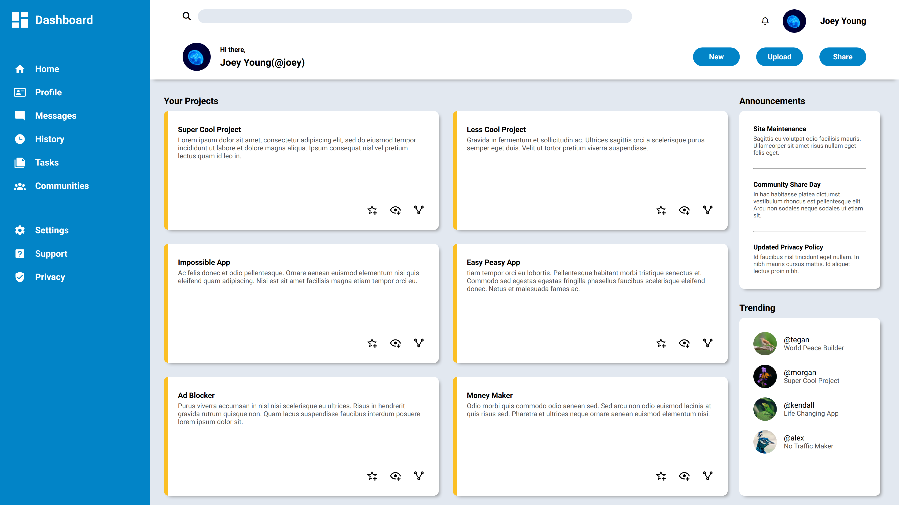

# Admin-Dashboard

The project was created for [The Odin Project - Admin Dashboard assignment](https://www.theodinproject.com/lessons/node-path-intermediate-html-and-css-admin-dashboard). The goal of the assignment was to create a webpage that matches the layout and look of the [provided design](https://cdn.statically.io/gh/TheOdinProject/curriculum/43cc6ab69fdfbef40d431a65677d2144668930ac/intermediate_html_css/grid/project_admin_dashboard/imgs/dashboard-project.png) using CSS Grid Layout.

## :link: [**Live Demo**](https://jqyoung.github.io/Admin-Dashboard/)

